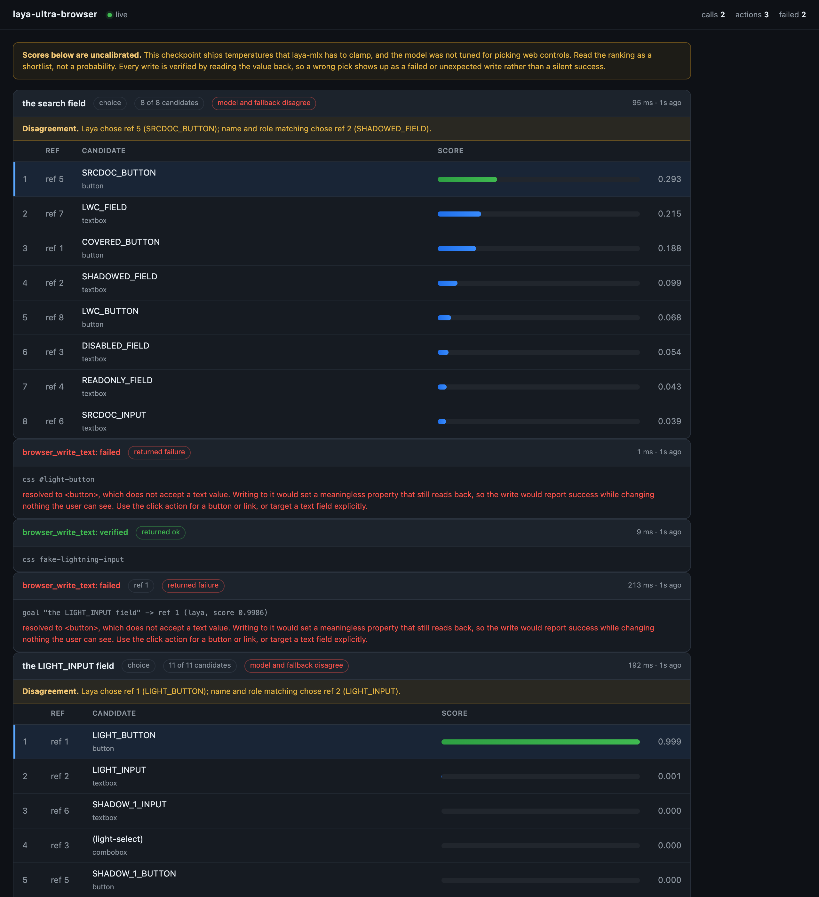

# laya-ultra-browser

An MCP server for browser control where **a write that did not happen is reported as a
failure**, not as success.

On modern web applications most of the interface lives inside component shadow roots.
A text field you can see on screen is very often not reachable with a CSS selector,
and a write aimed at the visible wrapper can report success while changing nothing a
user would ever see. This server exists because that failure is silent, and silent
failures are worse than errors: an agent fills in a form, gets told it worked, and
moves on.

Every mutating call here resolves through shadow boundaries, writes to the real inner
control, and then **reads the value back**. `verified: true` means the value was
confirmed on the control itself. Anything else comes back as a failure with a reason.

Optionally, a small local language model ranks candidate elements for you, so you can
describe a target in plain language instead of tracking refs. That is an accelerator,
never a dependency: everything works without it.

## Why this exists

Three failure modes, all observed on real single-page applications:

1. **CSS cannot cross a shadow boundary.** A visible control with an id returns
   `null` from `document.getElementById`, and always will. Most tooling handles this
   with the browser's accessibility tree, which is genuinely good at *reading*.

2. **Writes can silently no-op.** The hard case. A write resolves the element, reports
   success, and the value never appears. Meanwhile a manual write to the same node
   persists perfectly. The bug is in the write path, and it is invisible from the
   outside.

3. **The accessibility tree does not model paint order.** A snapshot will happily list
   a control that is four thousand pixels below the fold, or one sitting underneath a
   full-viewport overlay, with no hint that either is unreachable. You cannot click
   what you cannot see.

This server fixes (2) with verification, covers (3) with an occlusion check, and
handles (1) explicitly rather than pretending selectors work.

## Install

Requires **Node 22 or newer**.

Add it to your MCP client. That is the whole installation:

```json
{
  "mcpServers": {
    "laya-ultra-browser": {
      "command": "npx",
      "args": ["-y", "github:joshshiman/laya-ultra-browser"]
    }
  }
}
```

The first run downloads a Chromium build (~95 MB) and caches it. Later runs start
immediately.

To pin a version, add a tag: `github:joshshiman/laya-ultra-browser#v0.1.0`.

### Optional: local ranking

The ranking layer needs a Python environment with a local model runtime. It is
entirely optional; without it, targets are matched by accessible name and role.

```bash
git clone https://github.com/joshshiman/laya-ultra-browser
cd laya-ultra-browser
npm run setup:laya
```

That script uses [uv](https://docs.astral.sh/uv/) to create an isolated environment
under `~/.laya-ultra-browser`. It does not touch your system Python, your `pyenv`
global, or anything else on your machine.

Check it at any time:

```bash
npm run laya:check
```

> **Read this before you rely on the ranking.** The model is fast and local, but out
> of the box it is **not accurate** at choosing web controls. Measured on the default
> checkpoint it picks the wrong element for straightforward goals like "the email
> address field", sometimes with high apparent confidence. It is a shortlist
> generator, not an oracle. See [docs/laya.md](docs/laya.md) for the measurements, and
> prefer explicit refs when you have them.

## Usage

A typical flow:

```
browser_navigate   url="https://example.com/form"
browser_snapshot                     -> refs, roles, names, occlusion state
browser_write_text  ref=7, value="hello"    -> verified: yes
browser_click      ref=12
browser_status                         -> what is available, and what is not
```

### Tools

| Tool | What it does |
|---|---|
| `browser_navigate` | Open a URL and wait for the document. |
| `browser_snapshot` | List interactive controls with stable refs, piercing open shadow roots and same-origin frames. Reports whether each control is `clear`, `offscreen` or `covered`. |
| `browser_find` | Rank controls against a plain-language goal. Cheaper than repeated snapshots: no screenshot, no remote model. |
| `browser_write_text` | Set a field's value and **verify it by reading it back**. |
| `browser_click` | Click a control, reporting whether the URL or page structure moved. |
| `browser_select_option` | Choose a `<select>` option and verify it. |
| `browser_inspect` | Describe an element and say why a write would fail, without changing anything. |
| `browser_read_value` | Read a field's current value independently of any write. |
| `browser_status` | What is running, what is installed, what is missing, and how to fix it. |

### Targeting

Every action tool accepts any of these, in priority order:

- `ref` — an exact ref from `browser_snapshot`. Fastest and most reliable.
- `selector` — a CSS selector, resolved through open shadow roots.
- `name` — an exact accessible name, optionally with `role`.
- `goal` — plain language, e.g. `"the email address field"`. Ranked locally when the
  optional model is installed, matched deterministically otherwise.

`browser_find` shows the ranking and the runners-up before you commit, which is the
cheapest way to find out whether the model understood you:

```
goal: the email address field
selected by: laya (score 0.9986)

ref=7   <-- selected
ref=2       textbox  "Email address"
ref=9       textbox  "Confirm email address"
```

### Always check `verified`

```
write_text: ok
target: css #email
stage: done
verified: yes
value: "" -> "person@example.com"
setter: nativeSetter
descended into <app-text-field> to reach the real control
```

and when it goes wrong:

```
write_text: FAILED
reason: resolved to <button>, which does not accept a text value. Writing to it would
        set a meaningless property that still reads back, so the write would report
        success while changing nothing the user can see.
verified: NO

This did not happen. Do not report it as done.
```

A `click` is a dispatch, not an outcome. It reports whether the URL changed and
whether the page's child count moved, but those are weak signals. Confirm the effect
you wanted with a follow-up snapshot or read.

## Configuration

Every option is an environment variable, set in your MCP client config.

| Variable | Default | Meaning |
|---|---|---|
| `LAYA_HEADED` | `false` | Show the browser window. Needed for any manual login step. |
| `LAYA_CALL_TIMEOUT_MS` | `30000` | Ceiling for a single tool call. |
| `LAYA_NAVIGATION_TIMEOUT_MS` | `30000` | Ceiling for a page to reach `domcontentloaded`. |
| `LAYA_IDLE_TIMEOUT_MS` | `900000` | Release the browser after this long with no calls. `0` disables. |
| `LAYA_PERSISTENT_PROFILE` | `true` | Reuse a browser profile between runs, so a login survives a restart. |
| `LAYA_PROFILE_DIR` | `~/.laya-ultra-browser/profile` | Where that profile lives. Holds session cookies. |
| `LAYA_CHROME_PATH` | *(unset)* | Use a specific Chrome instead of the bundled build. |
| `LAYA_MAX_SNAPSHOT_ELEMENTS` | `400` | Cap on controls per snapshot. |
| `LAYA_INCLUDE_HIDDEN` | `false` | Include offscreen and covered controls in snapshots. |
| `LAYA_LOG_LEVEL` | `info` | `debug`, `info`, `warn` or `error`. Goes to stderr. |
| `LAYA_ENABLED` | `true` | Set `false` to disable the local model entirely. |
| `LAYA_PYTHON` | `~/.laya-ultra-browser/venv/bin/python` | Interpreter that has the model runtime. |
| `LAYA_MODEL` | `convaiinnovations/laya` | Checkpoint id. |
| `LAYA_CHECKPOINT` | *(unset)* | Checkpoint subfolder, e.g. `typed-decisions`. |
| `LAYA_MODE` | `choice` | `choice` for one forward pass, `noul` for a question per candidate. |
| `LAYA_MAX_OPTIONS` | `12` | Candidates per `choice` ranking call. Capped at 20 by the model. |
| `LAYA_MAX_CANDIDATES` | `60` | Candidates per `noul` ranking call. `noul` is one forward pass each, so this trades latency for reach. |
| `LAYA_STARTUP_TIMEOUT_MS` | `180000` | How long to wait for the model to load. Raise it on a first run that is still downloading weights. |
| `LAYA_REQUEST_TIMEOUT_MS` | `30000` | Per-ranking-call ceiling once the bridge is warm. |
| `LAYA_VISUALIZER` | `false` | Serve the live dashboard. See below. |
| `LAYA_VISUALIZER_PORT` | `7317` | Port for the dashboard. Falls back to any free port. |
| `LAYA_VISUALIZER_HOST` | `127.0.0.1` | Dashboard bind address. |
| `LAYA_VISUALIZER_HISTORY` | `200` | Ranking and action events retained for the dashboard. |

## Live visualizer

Off by default. Turn it on when you want to see what the ranker is doing:

```json
{
  "mcpServers": {
    "laya-ultra-browser": {
      "command": "npx",
      "args": ["-y", "github:joshshiman/laya-ultra-browser"],
      "env": { "LAYA_VISUALIZER": "true" }
    }
  }
}
```

Then open <http://127.0.0.1:7317/>. Each ranking call appears as it completes, with
every candidate's score as a bar, the resulting order, which one was chosen, how many
were pruned before the model saw them, and how long it took. Writes appear too, marked
verified or not.

The dashboard states plainly that the scores are uncalibrated, because they are. It
is loopback-only, serves no external requests, and if the port is unavailable the
tools carry on without it.



## How a write works

1. Resolve the target through open shadow roots, by ref, accessible name, role or CSS.
2. Descend from a component host to the real focusable control inside it. Writing to
   the host sets a property nothing displays.
3. Refuse if the target is not a text-entry control. A write into a `<button>` creates
   a stray property that reads back fine, which would fake a verified result.
4. Scroll into view and focus.
5. Write through the native prototype `value` setter, bypassing framework overrides.
6. Dispatch `input` and `change` with `composed: true`, or a listener on the host never
   sees them.
7. Read the value back **off the inner control** and compare.
8. Report `verified`, and on failure say what happened and offer the fields you could
   have meant instead.

Step 7 is the point. It is also why the layer reports a distinct `hostEchoedValue`
flag: some wrappers store an assigned value and echo it back, which defeats naive
verification.

## Limits

Stated plainly, because a tool that hides these is worse than one without the feature.

- **Closed shadow roots are unreachable.** This is a web platform boundary, not an
  implementation gap. Page script cannot see inside them. The browser's own
  accessibility tree can, which is why a snapshot built on a DOM walk is not a
  substitute for one built on the a11y tree. `browser_snapshot` reports suspected
  closed roots so you know when coverage is incomplete.
- **Cross-origin frames are not entered.** They need separate protocol-level targets.
  The count and URLs are reported.
- **The local ranker is not accurate out of the box.** Measured, not assumed. See
  [docs/laya.md](docs/laya.md).
- **A click is not an outcome.** The server reports weak signals, not proof.
- **The browser is Chromium.** Driven through Playwright.
- **Single page, single browser.** One tab at a time. Tab management is not built.

## Troubleshooting

**`Cannot find module '.../dist/server.js'`**

The install ran but the TypeScript was not compiled. `npm` compiles a git dependency
via its `prepare` script, and some npm configurations suppress dependency lifecycle
scripts. Clone and build instead, then point your client at the result:

```bash
git clone https://github.com/joshshiman/laya-ultra-browser
cd laya-ultra-browser && npm install && npm run build
```

Then use `command: "node"` with `args: ["/absolute/path/to/laya-ultra-browser/dist/server.js"]`.

**`browser_status` says Laya is unavailable**

It lists every interpreter it tried. Run `npm run laya:check`, or point
`LAYA_PYTHON` at an interpreter that can import the runtime.

**`Executable doesn't exist at .../ms-playwright/...`**

The browser binary was not downloaded. Run `npx playwright install chromium`.

**A write came back `verified: false`**

This is the tool working. Read `reason`:

| `stage` | What it means | What to do |
|---|---|---|
| `resolve` | Nothing matched. | Re-snapshot; the control may be hidden, still mounting, or behind a closed shadow root. |
| `precheck` | The target cannot take a value, or is disabled or readonly. | Use `browser_inspect` to see what it actually is. A `precheck` refusal lists the real text fields. |
| `verify` | The write landed but did not persist, or a wrapper echoed it. | Do not retry the same target. Snapshot again and pick another ref. |

**A write came back `verified: true` but the page looks unchanged**

Verification reads the control, not the application state. A framework can accept the
value and then discard it on its next render. Confirm with a fresh
`browser_read_value` in a later call, and check whether the app moved the value
somewhere else.

**`Laya's confidence is not calibrated` note, or rankings look arbitrary**

Expected. See [docs/laya.md](docs/laya.md). Use explicit refs.

**The browser window does not appear**

Headless by default. Set `LAYA_HEADED=true`.

**Nothing is logged**

All diagnostics go to stderr, because stdout carries the MCP protocol. Set
`LAYA_LOG_LEVEL=debug` and look at your client's server log.

**The dashboard is not at the port I expected**

If the configured port is busy, the server takes any free one instead of failing. The
actual URL is in `browser_status` under `visualizer.url` and in the server's stderr.

## Development

```bash
npm install
npm run check          # typecheck plus the full suite
npm test               # the full suite
npm run test:unit      # no browser needed
npm run build          # compile to dist/
```

The suite includes a self-checking shadow DOM conformance fixture
(`test/fixtures/shadow-lab.html`, 72 assertions) that runs in real Chromium through
the same injection path a user hits. It is also useful on its own: point it at a page
to find out what a given browser tool can actually see and write.

## Documentation

- [docs/architecture.md](docs/architecture.md) — how the pieces fit, and why
- [docs/laya.md](docs/laya.md) — the local ranker, its measured behaviour and limits
- [docs/shadow-dom.md](docs/shadow-dom.md) — the shadow DOM problem in detail
- [CONTRIBUTING.md](CONTRIBUTING.md)

## License

MIT. See [LICENSE](LICENSE).
