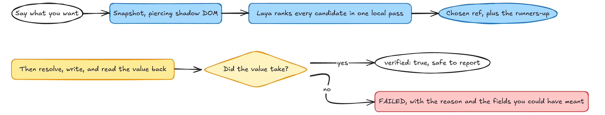
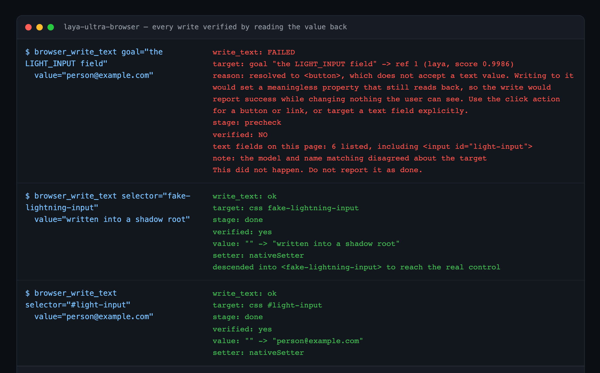

# laya-ultra-browser

[](https://github.com/joshshiman/laya-ultra-browser/actions/workflows/ci.yml)
[](LICENSE)
[](https://nodejs.org)
[](https://modelcontextprotocol.io)
[](docs/laya.md)
[](#platform-support)

**A browser MCP server where a local Laya model decides what to click, and every write
is verified by reading the value back.**

Most browser agents work like this: screenshot the page, send the image to a large
model, get back a coordinate, act, repeat. That costs an image and a network round trip
on **every single step**, and a lot of tokens for a decision that is really just "which
of these twelve things did they mean?"

This one skips the screenshot entirely. Laya is a small local encoder, so the server
hands it the page's control table as text and gets a ranking back from **one forward
pass** in roughly a tenth of a second. No image is generated, no token is spent on
pixels, and nothing leaves your machine.



Then the part that makes a probabilistic model safe to put in the loop: **Laya only
ever ranks.** It never touches the page and never decides that an action worked. That
job belongs to a verified write path, and because that path reads the value back off
the real control, a wrong guess becomes a refusal instead of a silent no-op.



## Why the model cannot quietly break something

This is the whole design, and it is worth being blunt about it.

On component-heavy web applications, a write can resolve the element, report success,
and change nothing a user would ever see. Assigning a value to a `<button>` is the
cleanest example: it creates a plain property, the value persists, a read-back matches,
and an unguarded tool reports a cheerful success for a write that went nowhere.

Read-back verification is necessary but not sufficient, because it answers *"did the
value land on the node I wrote to?"* and not *"was that the right node?"* So the write
path also **refuses targets that cannot hold a value**, and the refusal lists the text
fields you could have meant. That is the first red block in the screenshot above: Laya
ranked a button first for a field goal, and instead of a fake success you get the
reason and the alternatives.

Three failure modes, all observed on real single-page applications:

1. **CSS cannot cross a shadow boundary.** A visible control with an id returns `null`
   from `document.getElementById`, and always will. One application surveyed had 86% of
   its controls behind a boundary, nested up to eight deep.

2. **Writes can silently no-op.** The hard case, above. Every in-page write mechanism
   works when driven directly, so the fault is in the tool's write path and is
   invisible from the outside.

3. **The accessibility tree does not model paint order.** A snapshot will list a
   control four thousand pixels below the fold, or one under a full-viewport overlay,
   with no hint that either is unreachable. You cannot click what you cannot see.

## What Laya does here, concretely

Measured on an M-series Mac, not projected:

| | |
|---|---|
| Rank a page's candidates | **one forward pass, 100-270 ms** |
| Screenshots per action | **zero** |
| Image tokens per action | **zero** |
| Network calls per action | **zero**, it runs on your GPU |
| Ranking 4 candidates in `noul` mode | 3.1 s, one pass each |

Laya is a bidirectional encoder with no token decoding, so it cannot generate a plan or
a selector. It can only score options you give it, which is exactly the right shape for
this job: the model contributes fast semantic ranking over many candidates at once, and
deterministic code contributes everything that has to be correct.

It also gets cheaper the more you use it. There is no per-step model call to optimise,
because there is no per-step model call.

### Honest status of the model

**The base checkpoint is not accurate yet, and you should know that before you rely on
it.** Measured here, asked which of five form fields is the email address, it picked
"First name". Asked to find one deal out of five by region and value, it picked the
wrong one. Its confidence is not calibrated, and the model's own authors concluded that
confidence gating cannot protect you.

So it is wired as a **shortlist generator behind a deterministic matcher**, never as the
decider, and three things make that safe:

- Every ranking is compared against what plain name-and-role matching would have
  chosen, and a disagreement is reported loudly. The dashboard shows both.
- A ranking whose scores are all but identical is treated as *no decision at all* and
  falls back to the deterministic answer.
- Whatever the model picks, the write still has to verify.

If you want it to be genuinely good at picking controls, the supported path is
fine-tuning, and [`docs/laya.md`](docs/laya.md) has the measurements, the cost, and a
step-by-step route to it. For the wider picture, including the prompt-injection limit
this design does not remove, read [`SECURITY.md`](SECURITY.md). Short version: auto-generate labels with the deterministic
matcher, fine-tune upstream, convert with `laya-mlx convert`, point `LAYA_MODEL` at it.

## Platform support

The browser tools work anywhere Playwright's Chromium runs. The local model does not,
and pretending otherwise would waste your afternoon.

| | Browser tools | Local Laya ranking |
|---|---|---|
| macOS, Apple Silicon | yes | yes |
| macOS, Intel | yes | no |
| Linux | yes | no |
| Windows | yes | no |

Laya runs through [MLX](https://github.com/ml-explore/mlx), which is Apple-GPU only.
On other platforms every tool still works; goals are matched by accessible name and
role instead, and `browser_status` says so rather than failing quietly.

If you only need the browser tools, ignore the Laya section below entirely. There is
nothing else to install.

## Install

Requires **Node 22 or newer**.

Add it to your MCP client. That is the whole installation:

```json
{
  "mcpServers": {
    "laya-ultra-browser": {
      "command": "npx",
      "args": ["-y", "github:joshshiman/laya-ultra-browser"]
    }
  }
}
```

The first run downloads a Chromium build (~95 MB) and caches it. Later runs start
immediately.

**On Linux** you may also need Chromium's shared libraries, which is what
`npx playwright install --with-deps chromium` installs. If the server starts and then
reports a missing `.so` file, run that.

**Behind a proxy**, set `HTTPS_PROXY` in the config block; Playwright and the model
download both honour it.

**If the install produced no `dist/`** and the server cannot start, see
[Troubleshooting](#troubleshooting). npm sometimes suppresses a git dependency's
lifecycle scripts, and the TypeScript then never gets compiled.

To pin a version, add a tag: `github:joshshiman/laya-ultra-browser#v0.1.0`.

That is enough to get a working browser server. To get the local ranker, which is the
point of the tool, add one more step.

### Add the local ranker

Laya runs through [MLX](https://github.com/ml-explore/mlx) on your GPU, so it needs a
Python environment. The setup script makes one, isolated, in about a minute:

```bash
git clone https://github.com/joshshiman/laya-ultra-browser
cd laya-ultra-browser
npm run setup:laya
```

It uses [uv](https://docs.astral.sh/uv/) to fetch a managed interpreter, so it does not
care what Python you already have, and it installs into `~/.laya-ultra-browser` without
touching your system Python or your `pyenv` global. First run downloads roughly 2 GB of
model weights; after that it loads in under half a second.

The server finds that environment on its own. Check it any time with:

```bash
npm run laya:check
```

You can skip this step entirely. Every tool still works; goals are matched by accessible
name and role instead, and `browser_status` says which mode you are in rather than
failing quietly.

> **Before you rely on the ranking, read
> [Honest status of the model](#honest-status-of-the-model) above.** It is fast, local
> and free, and it is not accurate out of the box. It is a shortlist generator whose
> picks are always verified, not an oracle.

## Usage

A typical flow:

```
browser_navigate   url="https://example.com/form"
browser_snapshot                     -> refs, roles, names, occlusion state
browser_write_text  ref=7, value="hello"    -> verified: yes
browser_click      ref=12
browser_status                         -> what is available, and what is not
```

### Tools

| Tool | What it does |
|---|---|
| `browser_navigate` | Open a URL and wait for the document. |
| `browser_snapshot` | List interactive controls with stable refs, piercing open shadow roots and same-origin frames. Reports whether each control is `clear`, `offscreen` or `covered`. |
| `browser_find` | Rank controls against a plain-language goal. Cheaper than repeated snapshots: no screenshot, no remote model. |
| `browser_write_text` | Set a field's value and **verify it by reading it back**. |
| `browser_click` | Click a control, reporting whether the URL or page structure moved. |
| `browser_select_option` | Choose a `<select>` option and verify it. |
| `browser_inspect` | Describe an element and say why a write would fail, without changing anything. |
| `browser_read_value` | Read a field's current value independently of any write. |
| `browser_status` | What is running, what is installed, what is missing, and how to fix it. |

### Targeting

Every action tool accepts any of these, in priority order:

- `ref` — an exact ref from `browser_snapshot`. Fastest and most reliable.
- `selector` — a CSS selector, resolved through open shadow roots.
- `name` — an exact accessible name, optionally with `role`.
- `goal` — plain language, e.g. `"the email address field"`. Ranked locally when the
  optional model is installed, matched deterministically otherwise.

### Refs go stale, and you will be told why

A ref identifies a node in one snapshot. Navigate, or let the framework re-render, and
it no longer points at what it did. Rather than let that surface as a confusing
mismatch, every action re-checks the ref first and says which of the three things went
wrong:

```
Error: ref 4 is stale: it is scrolled out of view.

Hint: Refs stay valid until the page navigates or the DOM is replaced.
Call browser_snapshot again and use a ref from the new list, or pass a goal instead.
```

The reasons are "the node is no longer in the document", "it is hidden, collapsed or
has zero size", "it is scrolled out of view", and "something is covering it, so a click
would land on the wrong element". The last one matters most: a covered control looks
perfectly present in a snapshot, and clicking it would hit whatever is on top.

### Seeing what the ranker thought

`browser_find` shows the ranking and the runners-up before you commit, which is the
cheapest way to find out whether the model understood you:

```
goal: the email address field
selected by: laya (score 0.9986)
WARNING: Laya and the deterministic matcher disagree about the target. The model's
pick was used; pass an explicit ref if you already have one.

ref=7   <-- selected
ref=2       textbox  "Email address"
ref=9       textbox  "Confirm email address"
```

That warning is the point. The deterministic matcher runs on every goal regardless, so
its answer is always available to compare against, and a mismatch means the model's
pick is worth checking before you act on it.

### Always check `verified`

```
write_text: ok
target: css #email
stage: done
verified: yes
value: "" -> "person@example.com"
setter: nativeSetter
descended into <app-text-field> to reach the real control
```

and when it goes wrong:

```
write_text: FAILED
reason: resolved to <button>, which does not accept a text value. Writing to it would
        set a meaningless property that still reads back, so the write would report
        success while changing nothing the user can see.
verified: NO

This did not happen. Do not report it as done.
```

A `click` is a dispatch, not an outcome. It reports whether the URL changed and
whether the page's child count moved, but those are weak signals. Confirm the effect
you wanted with a follow-up snapshot or read.

## Configuration

Every option is an environment variable, set in your MCP client config.

| Variable | Default | Meaning |
|---|---|---|
| `LAYA_HEADED` | `false` | Show the browser window. Needed for any manual login step. |
| `LAYA_CALL_TIMEOUT_MS` | `30000` | Ceiling for a single tool call. |
| `LAYA_NAVIGATION_TIMEOUT_MS` | `30000` | Ceiling for a page to reach `domcontentloaded`. |
| `LAYA_IDLE_TIMEOUT_MS` | `900000` | Release the browser after this long with no calls. `0` disables. |
| `LAYA_PERSISTENT_PROFILE` | `true` | Reuse a browser profile between runs, so a login survives a restart. |
| `LAYA_PROFILE_DIR` | `~/.laya-ultra-browser/profile` | Where that profile lives. Holds session cookies. |
| `LAYA_CHROME_PATH` | *(unset)* | Use a specific Chrome instead of the bundled build. |
| `LAYA_MAX_SNAPSHOT_ELEMENTS` | `400` | Cap on controls per snapshot. |
| `LAYA_INCLUDE_HIDDEN` | `false` | Include offscreen and covered controls in snapshots. |
| `LAYA_LOG_LEVEL` | `info` | `debug`, `info`, `warn` or `error`. Goes to stderr. |
| `LAYA_ENABLED` | `true` | Set `false` to disable the local model entirely. |
| `LAYA_PYTHON` | `~/.laya-ultra-browser/venv/bin/python` | Interpreter that has the model runtime. |
| `LAYA_MODEL` | `convaiinnovations/laya` | Checkpoint id. |
| `LAYA_CHECKPOINT` | *(unset)* | Checkpoint subfolder, e.g. `typed-decisions`. |
| `LAYA_MODE` | `choice` | `choice` for one forward pass, `noul` for a question per candidate. |
| `LAYA_MAX_OPTIONS` | `12` | Candidates per `choice` ranking call. Capped at 20 by the model. |
| `LAYA_MAX_CANDIDATES` | `60` | Candidates per `noul` ranking call. `noul` is one forward pass each, so this trades latency for reach. |
| `LAYA_STARTUP_TIMEOUT_MS` | `180000` | How long to wait for the model to load. Raise it on a first run that is still downloading weights. |
| `LAYA_REQUEST_TIMEOUT_MS` | `30000` | Per-ranking-call ceiling once the bridge is warm. |
| `LAYA_VISUALIZER` | `false` | Serve the live dashboard. See below. |
| `LAYA_VISUALIZER_PORT` | `7317` | Port for the dashboard. Falls back to any free port. |
| `LAYA_VISUALIZER_HOST` | `127.0.0.1` | Dashboard bind address. |
| `LAYA_VISUALIZER_HISTORY` | `200` | Ranking and action events retained for the dashboard. |

## Live visualizer

Off by default. Turn it on when you want to see what the ranker is doing:

```json
{
  "mcpServers": {
    "laya-ultra-browser": {
      "command": "npx",
      "args": ["-y", "github:joshshiman/laya-ultra-browser"],
      "env": { "LAYA_VISUALIZER": "true" }
    }
  }
}
```

Then open <http://127.0.0.1:7317/>.


Each ranking call appears as it completes, with every candidate's score as a bar, the resulting order, which one was chosen, how many
were pruned before the model saw them, and how long it took. Writes appear too, marked
verified or not.

It also flags the disagreement between Laya and the deterministic matcher, and says
when a ranking was too flat to be a decision at all.

The dashboard states plainly that the scores are uncalibrated, because they are. It is
loopback-only, serves no external requests, and if the port is unavailable the tools
carry on without it.

## How a write works

1. Resolve the target through open shadow roots, by ref, accessible name, role or CSS.
2. Descend from a component host to the real focusable control inside it. Writing to
   the host sets a property nothing displays.
3. Refuse if the target is not a text-entry control. A write into a `<button>` creates
   a stray property that reads back fine, which would fake a verified result.
4. Scroll into view and focus.
5. Write through the native prototype `value` setter, bypassing framework overrides.
6. Dispatch `input` and `change` with `composed: true`, or a listener on the host never
   sees them.
7. Read the value back **off the inner control** and compare.
8. Report `verified`, and on failure say what happened and offer the fields you could
   have meant instead.

Step 7 is the point. It is also why the layer reports a distinct `hostEchoedValue`
flag: some wrappers store an assigned value and echo it back, which defeats naive
verification.

## Limits

Stated plainly, because a tool that hides these is worse than one without the feature.

- **Closed shadow roots are unreachable.** This is a web platform boundary, not an
  implementation gap. Page script cannot see inside them. The browser's own
  accessibility tree can, which is why a snapshot built on a DOM walk is not a
  substitute for one built on the a11y tree. `browser_snapshot` reports suspected
  closed roots so you know when coverage is incomplete.
- **Cross-origin frames are not entered.** They need separate protocol-level targets.
  The count and URLs are reported.
- **The local ranker is not accurate out of the box.** Measured, not assumed. See
  [docs/laya.md](docs/laya.md).
- **A click is not an outcome.** The server reports weak signals, not proof.
- **The browser is Chromium.** Driven through Playwright.
- **Single page, single browser.** One tab at a time. Tab management is not built.
- **Refs are only valid until the DOM changes.** Every action re-checks and says why
  if not, but a long task across a re-rendering page will keep re-snapshotting.
- **The local ranker needs Apple Silicon.** See [Platform support](#platform-support).

## Troubleshooting

**`Cannot find module '.../dist/server.js'`**

The install ran but the TypeScript was not compiled. `npm` compiles a git dependency
via its `prepare` script, and some npm configurations suppress dependency lifecycle
scripts. Clone and build instead, then point your client at the result:

```bash
git clone https://github.com/joshshiman/laya-ultra-browser
cd laya-ultra-browser && npm install && npm run build
```

Then use `command: "node"` with `args: ["/absolute/path/to/laya-ultra-browser/dist/server.js"]`.

**`browser_status` says Laya is unavailable**

It lists every interpreter it tried. Run `npm run laya:check`, or point
`LAYA_PYTHON` at an interpreter that can import the runtime.

**`Executable doesn't exist at .../ms-playwright/...`**

The browser binary was not downloaded. Run `npx playwright install chromium`.

**A write came back `verified: false`**

This is the tool working. Read `reason`:

| `stage` | What it means | What to do |
|---|---|---|
| `resolve` | Nothing matched. | Re-snapshot; the control may be hidden, still mounting, or behind a closed shadow root. |
| `precheck` | The target cannot take a value, or is disabled or readonly. | Use `browser_inspect` to see what it actually is. A `precheck` refusal lists the real text fields. |
| `verify` | The write landed but did not persist, or a wrapper echoed it. | Do not retry the same target. Snapshot again and pick another ref. |

**A write came back `verified: true` but the page looks unchanged**

Verification reads the control, not the application state. A framework can accept the
value and then discard it on its next render. Confirm with a fresh
`browser_read_value` in a later call, and check whether the app moved the value
somewhere else.

**`Laya's confidence is not calibrated` note, or rankings look arbitrary**

Expected. See [docs/laya.md](docs/laya.md). Use explicit refs.

**The browser window does not appear**

Headless by default. Set `LAYA_HEADED=true`.

**Nothing is logged**

All diagnostics go to stderr, because stdout carries the MCP protocol. Set
`LAYA_LOG_LEVEL=debug` and look at your client's server log.

**The dashboard is not at the port I expected**

If the configured port is busy, the server takes any free one instead of failing. The
actual URL is in `browser_status` under `visualizer.url` and in the server's stderr.

## Development

```bash
npm install
npm run check          # typecheck plus the full suite
npm test               # the full suite
npm run test:unit      # no browser needed
npm run build          # compile to dist/
```

The suite includes a self-checking shadow DOM conformance fixture
(`test/fixtures/shadow-lab.html`, 72 assertions) that runs in real Chromium through
the same injection path a user hits. It is also useful on its own: point it at a page
to find out what a given browser tool can actually see and write.

## Documentation

- [docs/architecture.md](docs/architecture.md) — how the pieces fit, and why
- [docs/laya.md](docs/laya.md) — the local ranker, its measured behaviour and limits
- [docs/shadow-dom.md](docs/shadow-dom.md) — the shadow DOM problem in detail
- [CONTRIBUTING.md](CONTRIBUTING.md) — how to work on it
- [SECURITY.md](SECURITY.md) — threat model, including the prompt-injection limit this
  does **not** remove
- [CHANGELOG.md](CHANGELOG.md)

Diagrams are generated from Excalidraw sources in `docs/diagrams/`; run
`npm run diagrams` after editing a `.dsl`.

## License

MIT. See [LICENSE](LICENSE).
